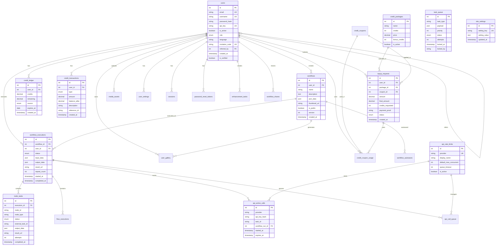

# AIKAFLOW - System Flow Diagrams

This document contains comprehensive flow diagrams for the AIKAFLOW application using Mermaid syntax.

---

## Table of Contents

1. [System Architecture Overview](#1-system-architecture-overview)
2. [User Authentication Flow](#2-user-authentication-flow)
3. [Workflow Execution Flow](#3-workflow-execution-flow)
4. [Credit System Flow](#4-credit-system-flow)
5. [Payment Processing Flow](#5-payment-processing-flow)
6. [API Integration Flow](#6-api-integration-flow)
7. [Webhook Processing Flow](#7-webhook-processing-flow)
8. [Plugin System Flow](#8-plugin-system-flow)
9. [Social Media Publishing Flow](#9-social-media-publishing-flow)
10. [Background Worker Flow](#10-background-worker-flow)
11. [User Journey Flow](#11-user-journey-flow)
12. [Database Entity Relationship](#12-database-entity-relationship)

---

## 1. System Architecture Overview


---

## 2. User Authentication Flow


---

## 3. Workflow Execution Flow


---

## 4. Credit System Flow


---

## 5. Payment Processing Flow


---

## 6. API Integration Flow

```mermaid
flowchart TD
    Start([Node Execution]) --> GetPlugin[Get Plugin Definition<br/>from plugin.json]
    GetPlugin --> CheckExecType{Execution<br/>Type?}
    
    CheckExecType -->|local| ExecuteLocal[Execute Local Logic]
    ExecuteLocal --> ReturnLocal[Return Result]
    ReturnLocal --> End([Complete])
    
    CheckExecType -->|api| GetAPIConfig[Get apiConfig<br/>from plugin.json]
    GetAPIConfig --> GetAPIKey[Get API Key]
    GetAPIKey --> KeySource{Key<br/>Source?}
    
    KeySource -->|Node Input| UseNodeKey[Use inputData.apiKey]
    KeySource -->|Admin Config| LoadAdminKey[Load from site_settings<br/>integration_keys]
    KeySource -->|None| KeyError[Error: No API Key]
    KeyError --> End
    
    UseNodeKey --> CheckRateLimit
    LoadAdminKey --> CheckRateLimit{Rate Limit<br/>Check}
    
    CheckRateLimit --> GetProvider[Get Provider<br/>rhub/kie/jcut/sapi]
    GetProvider --> QueryActiveSlots[Query api_active_calls<br/>for Provider + API Key]
    QueryActiveSlots --> CountSlots{Count <<br/>Limit?}
    
    CountSlots -->|No| QueueRequest[Add to api_call_queue]
    QueueRequest --> WaitForSlot[Wait for Available Slot]
    WaitForSlot --> SlotAvailable[Slot Available Event]
    SlotAvailable --> CheckRateLimit
    
    CountSlots -->|Yes| AcquireSlot[Create api_active_calls Entry<br/>with Temp Task ID]
    AcquireSlot --> MapRequest[Map Input Data to Request]
    MapRequest --> HasMapping{Has<br/>apiMapping?}
    
    HasMapping -->|Yes| UseMapping[Use Mapping Template<br/>{{variable}} syntax]
    HasMapping -->|No| DirectPass[Direct Passthrough<br/>Remove _ fields]
    
    UseMapping --> BuildRequest
    DirectPass --> BuildRequest[Build Request Body]
    BuildRequest --> AddWebhook[Add webhook_url]
    AddWebhook --> DetermineEndpoint[Determine API Endpoint]
    
    DetermineEndpoint --> ProviderURL{Provider?}
    ProviderURL -->|rhub| SetRHub[https://api.runninghub.ai]
    ProviderURL -->|kie| SetKie[https://api.kie.ai]
    ProviderURL -->|jcut| SetJCut[https://api.jsoncut.com]
    ProviderURL -->|sapi| SetSAPI[https://api.postforme.dev]
    
    SetRHub --> MakeRequest
    SetKie --> MakeRequest
    SetJCut --> MakeRequest
    SetSAPI --> MakeRequest[Make HTTP POST Request]
    
    MakeRequest --> SetHeaders[Set Headers:<br/>Authorization: Bearer {key}<br/>Content-Type: application/json]
    SetHeaders --> SendRequest[Send cURL Request]
    SendRequest --> CheckResponse{HTTP<br/>Success?}
    
    CheckResponse -->|No| ReleaseSlot1[Release api_active_calls]
    ReleaseSlot1 --> ReturnError[Return Error Response]
    ReturnError --> End
    
    CheckResponse -->|Yes| ParseResponse[Parse JSON Response]
    ParseResponse --> CheckAPIError{API Error<br/>Code?}
    
    CheckAPIError -->|Yes| ReleaseSlot1
    CheckAPIError -->|No| ExtractTaskID[Extract Task ID<br/>from Response]
    
    ExtractTaskID --> HasTaskID{Task ID<br/>Found?}
    HasTaskID -->|No| DirectResult[Return Direct Result]
    DirectResult --> ReleaseSlot1
    
    HasTaskID -->|Yes| UpdateSlot[Update api_active_calls<br/>with Real Task ID]
    UpdateSlot --> MapResponse[Map Response to Output]
    MapResponse --> HasResponseMap{Has Response<br/>Mapping?}
    
    HasResponseMap -->|Yes| UseResponseMap[Use $.path Mapping]
    HasResponseMap -->|No| PassThrough[Pass Through Response]
    
    UseResponseMap --> ReturnTaskID
    PassThrough --> ReturnTaskID[Return Task ID & Output]
    ReturnTaskID --> WaitWebhook[Wait for Webhook Callback]
    
    WaitWebhook --> WebhookArrives[Webhook Received]
    WebhookArrives --> ProcessWebhook[Process in webhook.php]
    ProcessWebhook --> ReleaseSlot2[Release api_active_calls]
    ReleaseSlot2 --> UpdateNodeTask[Update node_tasks<br/>with Result]
    UpdateNodeTask --> End

    style Start fill:#e1f5ff
    style End fill:#e1ffe1
    style KeyError fill:#ffe1e1
    style ReturnError fill:#ffe1e1
```

---

## 7. Webhook Processing Flow


---

## 8. Plugin System Flow


---

## 9. Social Media Publishing Flow


---

## 10. Background Worker Flow


---

## 11. User Journey Flow


---

## 12. Database Entity Relationship



---

## Additional Diagrams

### 13. Content Lifecycle Flow


### 14. Node Execution State Machine


### 15. Credit Balance State


---

## Diagram Usage Guide

### Viewing Diagrams

These Mermaid diagrams can be viewed in:

1. **GitHub**: Automatically rendered in markdown files
2. **VS Code**: Install "Markdown Preview Mermaid Support" extension
3. **Online Editors**: 
   - https://mermaid.live/
   - https://mermaid.ink/
4. **Documentation Sites**: GitBook, Docusaurus, MkDocs with Mermaid plugin

### Diagram Types Used

- **Flowchart**: Process flows and decision trees
- **Sequence Diagram**: Interaction between components over time
- **Entity Relationship**: Database schema relationships
- **State Diagram**: State transitions and lifecycle
- **Journey**: User experience mapping

### Customization

To customize these diagrams:

1. Copy the Mermaid code block
2. Paste into https://mermaid.live/
3. Edit using Mermaid syntax
4. Export as PNG/SVG or copy updated code

---

**Document Version**: 1.0.0  
**Last Updated**: January 24, 2026  
**Maintained By**: AIKAFLOW Development Team
